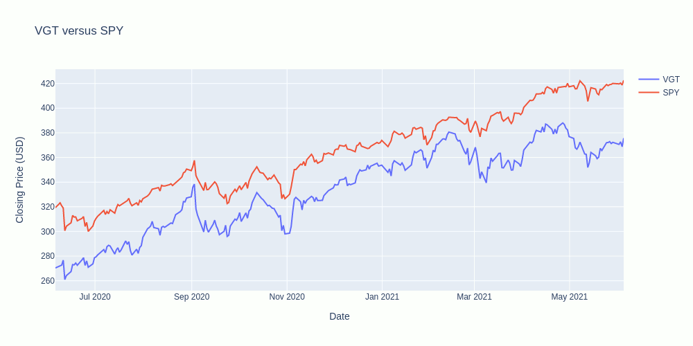

# Should_You_Invest_Into_Meme_Stocks
A look into the hype of "Meme" stocks and whether you should invest
---
# 🐍📈 Should You Invest Into "Meme" Stocks 📉🐍
---
## Members
- Ben McCright aka 👴 Boomer 👴
- Josh Ferguson aka 🦅 Proud Patriot 🇺🇸
- Cole Wood aka 💎 Diamond Hands 👐

# Introduction
## Online trading makes investing in the stock market more accessible than ever before, but how do you know what to invest in? You could spend your money on professional advice, you could spend your time researching stocks and monitoring the market, but a lot of people just invest in whatever is trending on social media.

## This project explores the 11 different sectors of the market and the S&P500 Index, comparing them in different ways with the goal of being a quick reference for people who want to do their own research before investing. We started by finding the minimum, median, and maximum beta-values in each sector, along with a mutual fund. For comparison, we use the S&P500 index itself under the tradeable fund SPY.

## Here's what we learned:

## Correlation is proportional with beta value, the mutual fund correlated the most.

## The biggest outlier was in the Healthcare sector.

## There can be correlation between search interest and closing price.

## Candlestick charts may display volatility. A longer candle means more variance in price.

## The SPY fund outperforms nearly all of the stocks we surveyed.

## The earlier you enter the market, the more potential you have for growth.

Meme stocks may be more volatile, but they have much more potential for growth in the short term.  You have to spend a lot of time monitoring them in order to know when to buy/sell.

# Conclusion